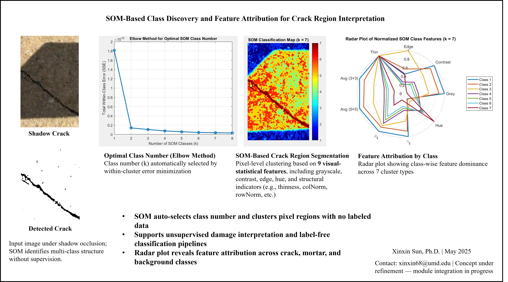

# Training-Free, Label-Free, and Interpretable Visual Diagnostics for Structural Health Monitoring (SHM)

This repository presents a fully automated, training-free, label-free, and interpretable visual diagnostic system for structural health monitoring (SHM). The system includes:

- **SOM-based crack region segmentation** using 9 visual-statistical features
- **Pseudo-label generation** to train CNNs without human annotation
- **Geometric alignment** for crack evolution tracking via KAZE + RANSAC
- **Thermal field mimicry** from RGB imagery (no IR sensor)

All components operate without manual labels, deep models, or parameter tuning, and can support robust SHM diagnostics in field conditions.

---

## 📊 Key Visual Results

### 🔹 SOM-Based Class Discovery & Feature Attribution

- Auto-selects class number using elbow method
- Identifies pixel-wise structure using grayscale, contrast, hue, edge, and geometry features
- Radar plot visualizes class-wise feature attribution

---

### 🔹 CNN Training via SOM Pseudo-Labels

- SOM generates masks for crack types
- Trains CNN without manual segmentation
- Supports multi-material crack detection (concrete, brick, shadowed)

---

### 🔹 KAZE-RANSAC Crack Alignment

- Robust unsupervised image alignment under field-induced distortion
- Tracks crack trajectories across time and angle changes
- Aligns images without ground-truth keypoints

---

### 🔹 Pseudo-Thermal Visualization (No IR Sensor)

- Simulates heat-like gradients around cracks using visual feature clustering
- Enables thermal-style visualization without IR hardware
- Supports sensor-free localization and monitoring

---

## 📁 Repository Structure

---

## 📄 Attribution

Some crack image backgrounds used in the demo visualizations were sourced from the:

- **CrackTAV Dataset**  
  GitHub: https://github.com/Chensq-cug/CrackTAV_dataset  
  License: MIT License  
  Author: [Chensq-cug](https://github.com/Chensq-cug)

These images are used strictly for **non-commercial, academic research** demonstration.  
All overlaid outputs (SOM masks, pseudo-thermal maps, CNN segmentation) are original works by **Xinxin Sun** (May 2025).

---

## 📬 Contact

**Xinxin Sun, Ph.D.**  
Structural Engineering, University of Maryland  
📧 xinxin68@umd.edu  
🗓️ May 2025  
Preprints available at: *[EngrXiv / TechRxiv links, if available]*  
