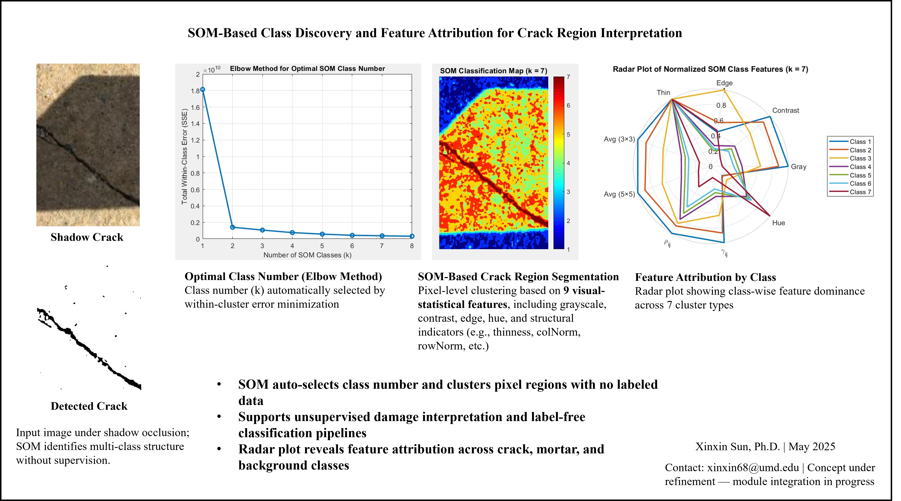
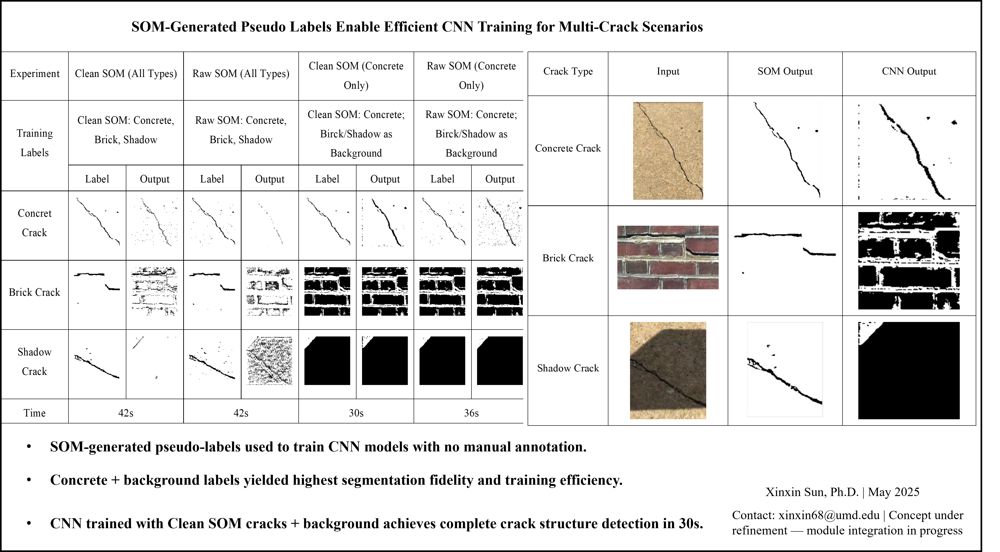
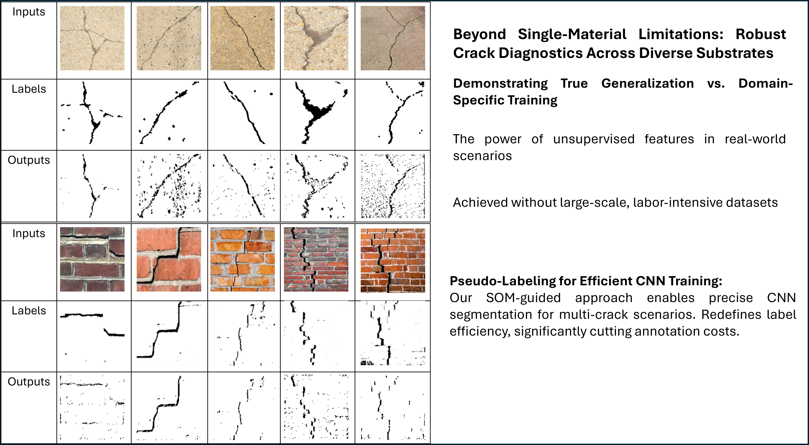
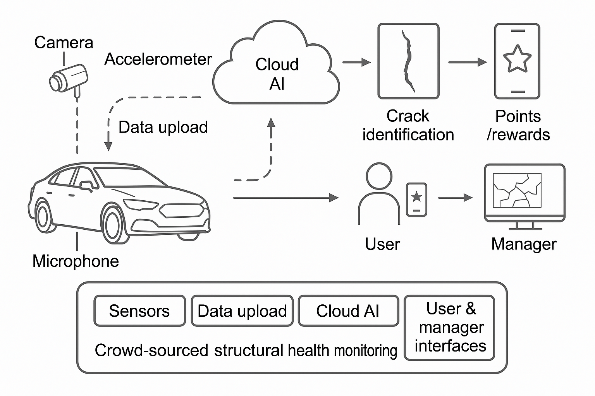

# Training-Free, Label-Free, and Interpretable Visual Diagnostics for Structural Health Monitoring (SHM)

This repository presents a fully automated, training-free, label-free, and interpretable visual diagnostic system for structural health monitoring (SHM). The system includes:

- **SOM-based crack region segmentation** using 9 visual-statistical features
- **Pseudo-label generation** to train CNNs without human annotation
- **Geometric alignment** for crack evolution tracking via KAZE + RANSAC
- **Thermal field mimicry** from RGB imagery (no IR sensor)

All components operate without manual labels, deep models, or parameter tuning, and can support robust SHM diagnostics in field conditions.
## 🌟 Highlights

- **Zero-Label SHM Pipeline**: No human annotations, no pretrained weights, no tuning.
- **SOM-Guided Vision Framework**: Clusters pixel-level features for interpretable segmentation.
- **Cross-Material Generalization**: One model segments cracks in concrete, brick, and shadowed surfaces—no domain-specific retraining.
- **CNN Pseudo-Labeling**: Auto-generates labels for CNNs, minimizing annotation costs.
- **Geometric Correction**: Unsupervised KAZE + RANSAC alignment enables crack evolution tracking.
- **Sensor-Free Thermal Proxy**: Pseudo-thermal degradation maps inferred from RGB images (no IR needed).
- **Open-Source, Deployable**: Lightweight, interpretable, and adaptable to field constraints.

> Designed for real-world SHM needs: explainability, zero annotation, deployment readiness.


---

## 📊 Key Visual Results

### 🔹 SOM-Based Class Discovery & Feature Attribution


- Auto-selects class number using elbow method
- Identifies pixel-wise structure using grayscale, contrast, hue, edge, and geometry features
- Radar plot visualizes class-wise feature attribution

---

### 🔹 CNN Training via SOM Pseudo-Labels


- SOM generates masks for crack types
- Trains CNN without manual segmentation
- Supports multi-material crack detection (concrete, brick, shadowed)

## 🔍 Visual Summary: Generalization & Pseudo-Labeling via SOM



**Figure: Robust crack diagnostics across diverse substrates using our SOM-guided framework.**  
Top: Concrete cracks; Bottom: Brick cracks.  

Our method demonstrates strong **cross-domain generalization** powered by **unsupervised feature clustering**, achieving accurate segmentation without labor-intensive, domain-specific training.  
It also enables efficient **pseudo-labeling** for CNN models, significantly reducing annotation costs in complex, multi-crack scenarios.

> This figure showcases the practicality of interpretable SHM vision pipelines in real-world diagnostics.

---

### 🔹 KAZE-RANSAC Crack Alignment


- Robust unsupervised image alignment under field-induced distortion
- Tracks crack trajectories across time and angle changes
- Aligns images without ground-truth keypoints

---

### 🔹 Pseudo-Thermal Visualization (No IR Sensor)


- Simulates heat-like gradients around cracks using visual feature clustering
- Enables thermal-style visualization without IR hardware
- Supports sensor-free localization and monitoring

---

🔒 Source code will be released upon formal publication of the associated research article.

## 📁 Repository Structure

```text
/code
  concrete.png                  # Example concrete crack image used in the SOM demo
  concrete_crack_som_demo.m     # End-to-end SOM crack segmentation + auto cleaning
  concrete_crack_som_demo_no.m  # Variant used for ablation / feature-removal studies

/docs
  Smart_SHM_Whitepaper.pdf      # Crowdsourced smart-city SHM concept note

/figures
  *.png                         # Figures used in the README and paper

XSun_SHM_Visual_Research_Portfolio.pdf  # Visual research portfolio (PDF)
README.md                                 # This file


## 🌐 System-Level Vision: Crowdsourced Smart City SHM

To extend this work toward scalable urban deployment, I propose a vision for **crowdsourced, sensor-free SHM** leveraging public vehicles as mobile sensing agents.

📌 Key ideas:
- Vehicles act as roaming data collectors via dashcams, accelerometers, and GPS.
- Visual/audio signals are uploaded through a mobile app, receiving rewards (ads, coupons) for contributions.
- Structural anomalies are identified using SOM-based diagnostics without requiring dense sensor networks.
- Aggregated data can support city-scale infrastructure monitoring at low cost.

This system complements existing fiber-based or edge-sensor SHM frameworks, offering **a lightweight, decentralized alternative** for urban resilience monitoring.

📄 [Smart_SHM_Whitepaper.pdf](docs/Smart_SHM_Whitepaper.pdf)  
🖼️ 

> *Concept under refinement – inspired by early 2015 idea notes and now integrated with recent vision-based SHM progress.*

---

## 📄 Attribution

Some crack image backgrounds used in the demo visualizations were sourced from the:

- **CrackTAV Dataset**  
  GitHub: https://github.com/Chensq-cug/CrackTAV_dataset  
  License: MIT License  
  Author: [Chensq-cug](https://github.com/Chensq-cug)

These images are used strictly for **non-commercial, academic research** demonstration.  
All overlaid outputs (SOM masks, pseudo-thermal maps, CNN segmentation) are original works by **Xinxin Sun** (May 2025).

---

## 📬 Contact

**Xinxin Sun, Ph.D.**  
Structural Engineering, University of Maryland  
📧 xinxin68@umd.edu  
🗓️ May 2025  
Preprints available at: https://doi.org/10.31224/4701
                        https://doi.org/10.31224/4697
                        https://doi.org/10.31224/4706 
